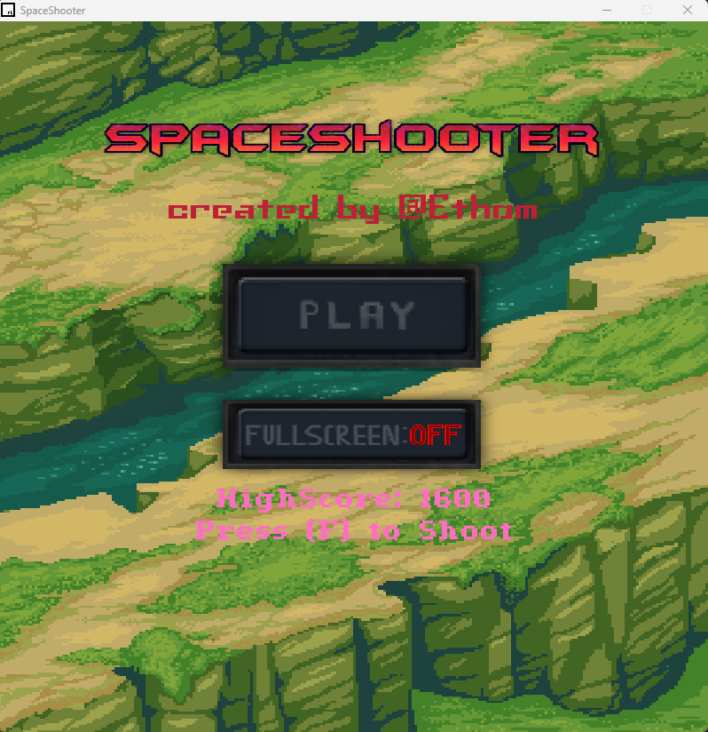
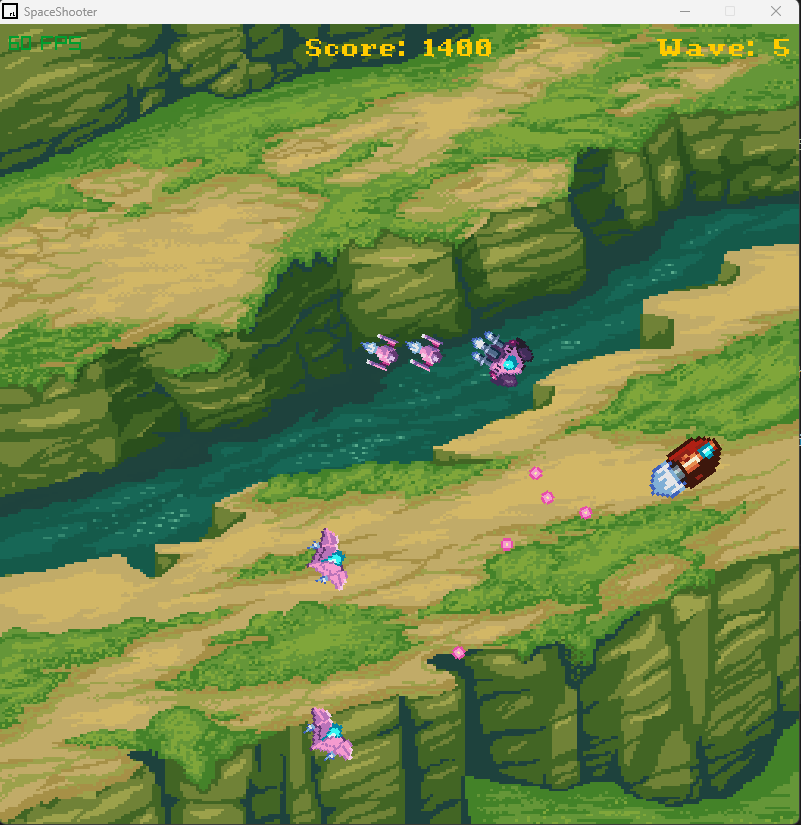

# SpaceShooter

## Description:

SpaceShooter is a 2D shooter created without the use of a conventional game engine. 

The game was programmed with C/C++ using the Raylib library, OpenGL, and my own personalized library for extra functionality.

All assets/artwork were created by me using libresprite and a SpaceShooter Environment asset pack by Ansimuz.
Space Shooter Environment: https://ansimuz.itch.io/spaceship-shooter-environment

Currently majority of production on the game has been finalized with minor updates from time to time.

**The game includes:**
- Fighting off waves of enemies
- Shooting for survival while avoiding being hit
- 3 types of enemies
- Complete randomness
- Stored HighScores

## Controls:
- Close = ESC
- Shoot = F
- Forwards = 🡅 / W 
- Backwards = 🡇 / S
- Rotate Left = 🡄 / A 
- Rotate Right = 🡆 / D 

## How to Access:
**Through Itch.io**

Link: https://ethanrce.itch.io/spaceshooter
1. Navigate to the website and click Download Now.
2. Download the appropiate version of the game for your OS. 
3. Unzip/Extract all files into a folder.
4. Run the "Spaceshooter" application.

**Through GitHub:**

Navigate to the link.

Link: https://github.com/ethanrce/SpaceShooter/releases/tag/1.0
